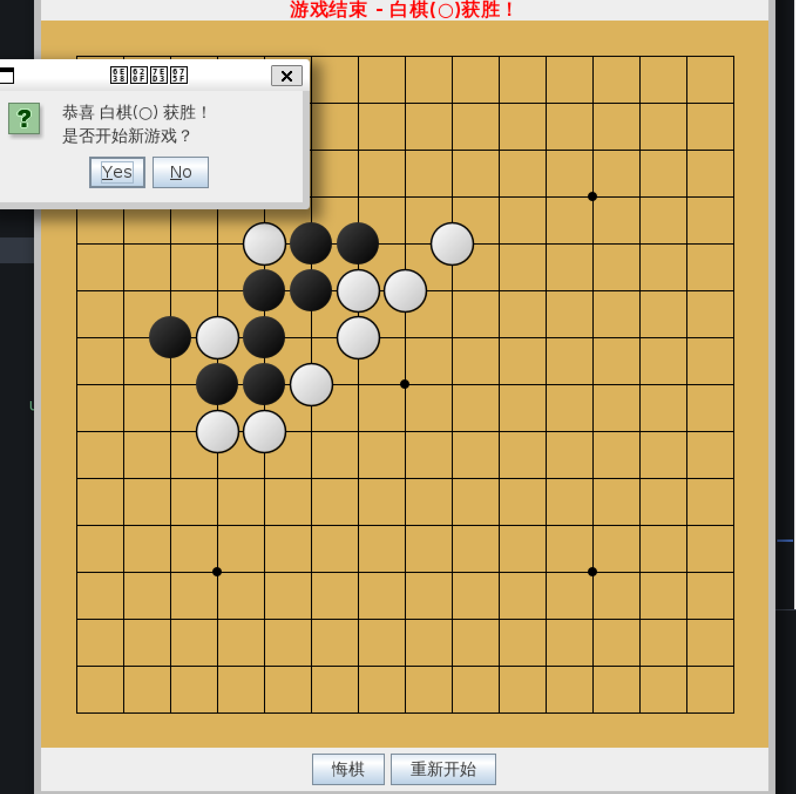

---

# 五子棋游戏 (Gomoku Game)

这是一个基于 Java Swing 实现的经典五子棋游戏项目，提供了完整的图形用户界面（GUI）和基础的命令行界面（CLI）两种模式。项目采用 Maven 进行构建和管理。

## ✨ 主要功能

*   **图形用户界面 (GUI)**: 提供了完整的可视化游戏体验，包括棋盘、棋子、状态显示等。
*   **命令行界面 (CLI)**: 支持在终端中进行游戏，适合无图形界面的环境。
*   **标准五子棋规则**: 在 15x15 的棋盘上，实现五子连珠获胜的判断。
*   **悔棋功能**: 玩家可以在游戏未结束时撤销上一步操作。
*   **重新开始**: 随时可以清空棋盘，开始一局新游戏。
*   **胜负与平局判断**: 自动检测游戏胜负或平局状态。

## 📁 项目结构

项目遵循标准的 Maven 目录结构，核心文件说明如下：

```
.
├── pom.xml                   # Maven 项目配置文件，定义了项目信息和构建规则
└── src/main/java/
    ├── Board.java            # 核心游戏逻辑：棋盘数据、落子、胜负判断、悔棋等
    ├── Gomoku.java           # 命令行版本的游戏主程序
    └── GomokuGUI.java        # Swing 图形界面版本的游戏主程序
```

*   `Board.java`: **游戏引擎**。它是一个纯粹的逻辑类，不包含任何界面元素，负责管理棋盘状态。
*   `Gomoku.java`: **命令行启动器**。它调用 `Board` 类，并通过控制台输入输出实现游戏。
*   `GomokuGUI.java`: **图形界面启动器**。它调用 `Board` 类，并通过 Swing 组件将游戏状态可视化。

## 🚀 环境准备与构建

在开始之前，请确保您的开发环境中安装了以下软件：

*   **JDK 21 或更高版本**: 项目 `pom.xml` 中指定了 Java 21，请确保您的 JDK 版本兼容。
*   **Maven**: 用于编译、打包和管理项目。

---

### 构建步骤

1.  **克隆或下载项目**
    将项目代码下载到您的本地计算机。

2.  **使用 Maven 构建**
    在项目根目录（即 `pom.xml` 所在的目录）打开终端或命令行，执行以下命令：

    ```bash
    mvn clean package
    ```
    此命令会完成以下工作：
    *   `clean`: 清理之前构建生成的所有文件（`target` 目录）。
    *   `package`: 编译所有 Java 源代码，并将其打包成一个 JAR 文件。

    构建成功后，您会在项目根目录下看到一个 `target` 文件夹。编译后的 `.class` 文件位于 `target/classes` 中，打包好的 JAR 文件为 `target/AiBattle-1.0-SNAPSHOT.jar`。

### 运行项目

您可以通过两种方式运行此项目：

#### 1. 运行图形界面版 (GUI) - **推荐**

在项目根目录打开终端，执行以下命令：

```bash
java -cp target/classes GomokuGUI
```
> **注意**: 直接运行 `java -jar ...` 可能无法启动，因为 `pom.xml` 中未配置 `Main-Class`。使用 `-cp` (classpath) 参数是运行未指定主类的 Maven 项目的标准方式。

#### 2. 运行命令行版 (CLI)

如果您想在终端中玩，可以执行以下命令：

```bash
java -cp target/classes Gomoku
```

## 🎨 字体与显示问题修复指南

Java Swing 程序在不同操作系统上可能会遇到字体渲染问题（乱码、方框`□`、锯齿、显示模糊等）。本项目代码已包含了解决这些问题的**最终方案**，以下是对这些方案的解释以及针对不同系统的适配建议。

### 已包含的解决方案

在 `GomokuGUI.java` 的 `main` 方法中，我们已经实现了：
1.  **全局抗锯齿**: 通过 `System.setProperty` 开启了字体平滑，解决了字体边缘的锯齿问题。
2.  **全局字体设置**: 遍历 `UIManager` 的所有默认项，将字体统一设置为高质量的 UI 字体，避免了因默认字体不支持中文而导致的方框`□`乱码。

### 针对不同系统的字体建议

当前代码中默认使用了 `"Microsoft YaHei UI"`，这是 Windows 平台下的最佳选择。如果您的团队成员使用不同操作系统，可以按以下建议修改 `GomokuGUI.java` 中 `main` 方法里的字体设置：

```java
// Font globalFont = new Font("Microsoft YaHei UI", Font.PLAIN, 14);
```

*   **Windows (当前默认)**:
    无需修改，`"Microsoft YaHei UI"` (微软雅黑) 是最佳选择。

*   **macOS**:
    建议将字体修改为 `"PingFang SC"` (苹方)，这是 macOS 的默认中文字体，显示效果优雅。
    ```java
    Font globalFont = new Font("PingFang SC", Font.PLAIN, 14);
    ```

*   **Linux (Ubuntu/Debian 等)**:
    Linux 系统默认可能不带中文字体，这是导致**方框 `□` 乱码**的常见原因。
    1.  **首先，安装中文字体库**。推荐安装“文泉驿正黑”，在终端执行：
        ```bash
        sudo apt-get update
        sudo apt-get install fonts-wqy-zenhei
        ```
    2.  **然后，修改代码中的字体**：
        ```java
        Font globalFont = new Font("WenQuanYi Zen Hei", Font.PLAIN, 14);
        ```
